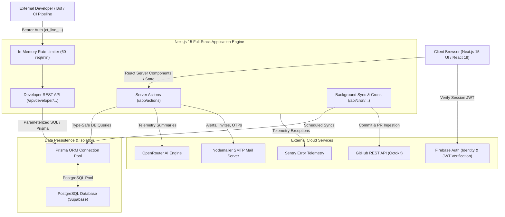

# 🏛️ ContriTrack System Architecture & Technical Specification

ContriTrack is a full-stack, AI-powered academic collaboration and telemetry platform engineered for university capstones, student engineering teams, hackathons, and developer communities.

This document details the high-level system architecture, data ingestion pipelines, cryptographic security models, and subsystem communication flows.

---

## 1. 🛠 Core Technology Stack

| Layer | Technologies & Frameworks |
| :--- | :--- |
| **Frontend Framework** | **Next.js 15** (App Router, React Server Components, Server Actions) |
| **Language & Typing** | **TypeScript 5.x** (Strict Mode) |
| **Styling & Animation** | **Tailwind CSS**, **Framer Motion**, **Lucide Icons** |
| **Database & ORM** | **PostgreSQL (Supabase)**, **Prisma ORM (v6)** |
| **Authentication & Identity** | **Firebase Authentication** & **Firebase Admin SDK** |
| **AI Intelligence Engine** | **OpenRouter API** (LLM-based collaboration coaching & sprint wrap-ups) |
| **Email & Alert Delivery** | **Nodemailer** (SMTP Transport) |
| **Developer API & Security** | Next.js REST Route Handlers, **SHA-256 Key Hashing**, In-Memory Token Rate Limiter |
| **Testing & Observability** | **Playwright**, **Sentry** |

---

## 2. 🏛 High-Level System Architecture Diagram

---

## 3. 🔄 End-to-End Data Flows & Subsystems

### 3.1. GitHub Telemetry & Jain's Fairness Index Calculation
1. **Repository Ingestion:** Users connect repositories via GitHub OAuth.
2. **Telemetry Streaming:** Background sync workers poll commit logs, author metadata, additions, and deletions from the GitHub REST API.
3. **Fairness Calculation:** The platform calculates **Jain's Fairness Index** across team members:
   $$\mathcal{J}(x_1, x_2, \dots, x_n) = \frac{\left( \sum_{i=1}^n x_i \right)^2}{n \sum_{i=1}^n x_i^2}$$
   where $x_i$ represents the normalized multi-factor contribution score (commits, line changes, deliverable completions).

---

### 3.2. AI Collaboration & Burnout Intelligence (`ai-actions.ts`)
1. **Telemetry Aggregation:** The server aggregates workspace velocity, missed deadlines, task overflow, and late-night activity patterns.
2. **AI Inference:** The payload is sent via server-side HTTPS fetch to the **OpenRouter API**.
3. **Structured Recommendations:** The model returns actionable JSON insights categorized into *Burnout Warnings*, *Free-Rider Flags*, *Parity Adjustments*, and *Sprint Projections*.
4. **Persistence:** Evaluations are persisted in the `AIInsight` and `BurnoutSignal` PostgreSQL tables and surfaced dynamically on the dashboard.

---

### 3.3. Academic Hubs Observatory Network (`/hubs`)
1. **Institutional Hub Routing:** Workspaces link to 5 specialized hubs (`capstone`, `open-source`, `ai-research`, `hackathon`, `faculty-oversight`).
2. **Cross-Project Aggregation:** Aggregates milestone completion rates, repository star/issue metrics, and researcher parity scores across multiple workspaces.

---

### 3.4. Developer REST API Gateway (`/api/developer/...`)
1. **Bearer Token Issuance:** Users generate `ct_live_[48-hex-chars]` tokens from the Developer Console.
2. **Cryptographic Storage:** Only the SHA-256 hash (`hashedKey`) is stored in PostgreSQL.
3. **Gateway Verification:** `validateApiKey` asserts key validity, checks expiration, validates scoped permissions (`read`, `write`, `read:tasks`, `write:tasks`, `read:metrics`, `admin`), and enforces rate limits (60 req/min).
4. **Live Endpoints Available:**
   - `GET /api/developer/workspaces`
   - `GET /api/developer/tasks` & `POST /api/developer/tasks`
   - `GET /api/developer/analytics`
   - `GET /api/developer/meetings` & `POST /api/developer/meetings`
   - `GET /api/developer/ai/insights`
   - `POST /api/developer/ai/sprint-summary`
   - `GET /api/developer/reports/export-csv`
   - `POST /api/developer/reports/generate-pdf`
   - `GET /api/developer/hubs` & `GET /api/developer/hubs/:slug`
   - `GET /api/developer/members/presence`
   - `GET /api/developer/standups` & `POST /api/developer/standups`
   - `POST /api/developer/ci/build-event`
   - `GET /api/developer/webhooks` & `POST /api/developer/webhooks`

---

### 3.5. Real-Time In-App Notifications & SMTP Mailer
1. **In-App Delivery:** Persistent notification inbox streaming updates via 10-second polling.
2. **Interactive Threads:** `NotificationReply` model allows inline threaded discussions directly inside notification cards.
3. **Outbound Email:** Nodemailer SMTP transporter dispatches branded HTML emails for workspace invites, 2FA OTP verification, account recovery, and critical security alerts.

---

### 3.6. Forensic Data Governance & Admin Wipeout (`admin-actions.ts`)
1. **Account Deletion Cascade:** `deleteUserAccountAdmin` executes atomic, forensic cascade deletion across all 20 database tables:
   - `User`, `UserProfile`, `UserSecurity`, `UserActivity`, `UserBackup`, `OTPSession`
   - `Workspace`, `WorkspaceMember`, `Task`, `TaskActivity`, `TaskComment`
   - `ContributionMetric`, `UserContributionAnalytics`, `BurnoutSignal`, `AIInsight`
   - `GitHubAccount`, `ApiKey`, `Report`, `Notification`, `NotificationReply`
2. **Identity Purge:** Synchronously deletes the user from **Firebase Authentication** by UID and email.

---

## 4. 🔐 Security & Data Protection

- **Row-Level Isolation:** Multi-tenant workspace isolation boundaries enforced at the query and server action layers.
- **Secret Management:** Sensitive credentials (`OPENROUTER_API_KEY`, `FIREBASE_PRIVATE_KEY`, `ENCRYPTION_KEY`, `CRON_SECRET`) reside strictly in server-side environment variables.
- **Client-Side Sanitization:** Plaintext API keys and database connection strings are never exposed to the client bundle.
