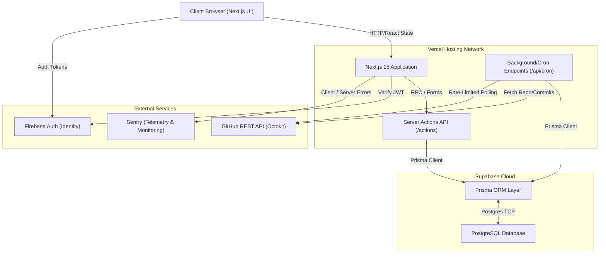

<div align="center">

# 📊 ContriTrack

## AI-Powered Academic Collaboration & Telemetry Platform

*A platform designed for students, developers, engineering teams, and hackathon communities to manage workspaces, track contributions, monitor fairness, and receive AI-powered insights.*


</div>

---

# 📖 Overview

Collaboration in student teams and developer communities often suffers from uneven contribution visibility, poor sprint transparency, and a lack of accountability. Tracking workflows manually leads to collaboration imbalance and disconnected productivity monitoring.

**ContriTrack** is an AI-powered **Collaboration and Telemetry Platform** that solves these challenges.

It centralizes collaboration intelligence into a single structured environment. By combining dynamic workspace management, real-time analytics, and AI-powered insights, ContriTrack transforms collaborative workflows into a structured, intelligent productivity ecosystem.

---

# ✨ Core Features

- 🏢 **Workspace Management:** Dynamic multi-user collaborative workspaces.
- 📊 **Analytics & Telemetry:** Contribution tracking, sprint analytics, and real-time dashboards.
- 🤖 **AI Insights:** Gemini-powered collaboration analysis and burnout-awareness indicators.
- 👥 **Teams Management:** Contributor roles, member classifications, and identity synchronization.
- 📅 **Meetings System:** Meeting scheduling, team discussions, and collaboration coordination.
- 🎯 **Recruitment Center:** Candidate application tracking and resume upload management.
- 🧠 **GitHub Integration:** Contribution monitoring and repository activity tracking.
- 📄 **Reports System:** Workspace performance reports and AI-generated insights.
- 🔒 **Settings & Security:** Profile management, alert controls, and secure authentication workflows.

---

# 🏗 Architecture



---

# 💻 System Modules

## 🏢 Workspace Management

Create and manage collaborative workspaces with dynamic initialization, workspace-specific analytics, telemetry, and comprehensive multi-user support.

---

## 📊 Overview Dashboard

Gain immediate visibility with workspace activity summaries, productivity snapshots, recent team activity, and AI-generated workspace observations.

---

## 🤖 AI Insights

Leverage the Gemini API for AI-powered collaboration analysis, productivity recommendations, contribution pattern evaluation, and burnout-awareness indicators.

---

## 📈 Analytics & Telemetry

Monitor engagement through contribution tracking systems, sprint analytics, productivity graphs, workspace engagement metrics, and real-time telemetry dashboards.

---

## 👥 Teams Management

Manage your contributors efficiently with role assignment systems, member classifications, workspace identity synchronization, and team collaboration monitoring.

---

## 📅 Meetings System

Coordinate effortlessly with a dedicated meeting scheduling interface, team discussion workflows, and robust workspace communication support.

---

## 🎯 Recruitment Center

Streamline team expansion with candidate application tracking, resume upload management, recruitment analytics, role-based candidate filtering, and recruitment dashboard systems.

---

## 🧠 GitHub Purging & Repository Utilities

Integrate seamlessly with GitHub for contribution monitoring, repository activity tracking, and visual GitHub telemetry.

---

## 📄 Reports System

Export and analyze workspace performance reports, contribution summaries, analytics exports, and AI-generated reporting insights.

---

## 🔒 Authentication System

Secure user access via Google Authentication, GitHub Authentication, and Email/Password with account restoration and secure account deletion workflows.

---

# 🧠 Engineering Concepts & Architecture Highlights

This project demonstrates several production-grade engineering concepts:

✅ Full-stack scalable architecture
✅ Modular component-based frontend system
✅ Real-time telemetry workflows
✅ AI-integrated analytics systems
✅ Production-grade monitoring (Sentry) and testing (Playwright) infrastructure
✅ Enterprise-inspired UI/UX patterns
✅ Responsive workspace ecosystem

---

# 🛠 Tech Stack

| Category | Technology |
| --- | --- |
| **Frontend** | Next.js 15, TypeScript, Tailwind CSS, Framer Motion, shadcn/ui |
| **Backend** | Node.js, Express.js |
| **Database & ORM** | Supabase PostgreSQL, Prisma ORM |
| **Authentication** | Firebase Authentication |
| **AI Systems** | Gemini API |
| **Monitoring & Testing** | Sentry, Playwright, GitHub Actions CI/CD |
| **Deployment** | Vercel |

---

# 📸 Screenshots

## 🏠 Overview Dashboard Screenshot


---

## 📊 Analytics Dashboard Screenshot


---

## 🤖 AI Insights Screenshot


---

## 👥 Teams Management Screenshot


---

## 📅 Meetings Workspace Screenshot


---

## 📄 Reports System Screenshot


---

## ⚙️ Settings & Security Screenshot


---

## 🧠 GitHub Purging & Telemetry Screenshot


---

# 🚀 Getting Started

## 1. Clone the Repository

```bash
git clone https://github.com/Khushi1310-nayak/ContriTrack.git
cd ContriTrack
```

## 2. Install Dependencies

```bash
npm install
```

## 3. Configure Environment Variables

Create a `.env.local` file and add the required variables:

```env
# SUPABASE DATABASE & STORAGE
NEXT_PUBLIC_SUPABASE_URL=
NEXT_PUBLIC_SUPABASE_ANON_KEY=
DATABASE_URL=
DIRECT_URL=

# FIREBASE AUTHENTICATION
NEXT_PUBLIC_FIREBASE_API_KEY=
NEXT_PUBLIC_FIREBASE_AUTH_DOMAIN=
NEXT_PUBLIC_FIREBASE_PROJECT_ID=
NEXT_PUBLIC_FIREBASE_STORAGE_BUCKET=
NEXT_PUBLIC_FIREBASE_MESSAGING_SENDER_ID=
NEXT_PUBLIC_FIREBASE_APP_ID=

# GITHUB OAUTH
GITHUB_CLIENT_ID=
GITHUB_CLIENT_SECRET=

# AI SYSTEMS
OPENAI_API_KEY=
GEMINI_API_KEY=

# SITE CONFIGURATION
NEXT_PUBLIC_SITE_URL=

# SMTP / EMAIL SYSTEM
SMTP_HOST=
SMTP_PORT=
SMTP_USER=
SMTP_PASS=
SMTP_FROM=

# SENTRY MONITORING
NEXT_PUBLIC_SENTRY_DSN=
SENTRY_AUTH_TOKEN=
SENTRY_ORG=
SENTRY_PROJECT=
```

## 4. Run Development Server

```bash
npm run dev
```

---

# 🔮 Future Roadmap

- Real-time collaboration systems
- AI-powered sprint optimization
- Advanced GitHub analytics
- Workspace role permissions
- Desktop application support
- Offline-first workspace architecture
- Team performance forecasting
- Cross-workspace analytics

---

# 🤝 Contributing

Contributions are welcome! Fork the repository, create a feature branch, and submit a pull request.

---

# 📄 License

This project is licensed under the MIT License.

---

# 👩💻 Author

## **Manisa Nayak**

🎓 Student | Full-Stack Developer | AI Product Builder

Passionate about:
- Full-Stack Architecture
- User Experience (UI/UX)
- AI Automation & Product Building

### Connect with Me

**GitHub:** [Khushi1310-nayak](https://github.com/Khushi1310-nayak)  
**LinkedIn:** [Manisa Nayak](https://www.linkedin.com/in/manisa-nayak-185bb5378/)

---

## ⭐ If you found this project interesting, consider giving it a Star
