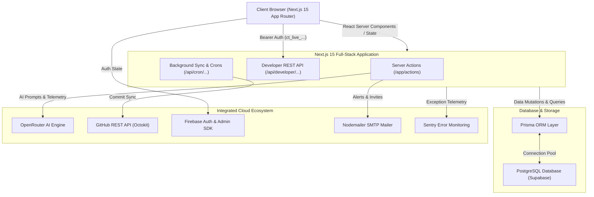

# 📊 ContriTrack

## AI-Powered Academic Collaboration & Telemetry Platform

*A modern, end-to-end platform engineered for students, developers, engineering teams, and university capstones to manage workspaces, track deliverables, analyze contribution fairness, and harness AI-powered collaboration insights.*


---

# 📖 Overview

Collaboration in student project teams and engineering communities frequently faces uneven workload distribution, lack of visibility into individual contributions, and subjective grading. Traditional task managers track what is planned, but rarely quantify who actually built it.

**ContriTrack** is a full-stack **Academic Collaboration and Telemetry Platform** that solves these challenges.

It combines dynamic multi-tenant workspace management, live GitHub commit telemetry, automated task sprints, real-time presence, and **OpenRouter-powered AI insights** with mathematical collaboration scoring (**Jain's Fairness Index**). ContriTrack transforms project coordination into an accountable, transparent, and intelligent productivity ecosystem.

---

# ✨ Core Features

- 🏢 **Multi-Tenant Workspaces:** Dynamic workspace creation, teammate role assignments, and 5-minute rolling cryptographic invite codes.
- 📊 **Telemetry & Jain's Fairness Index:** Real-time analytics calculating commit shares, lines changed, deliverable velocity, and mathematical workload fairness.
- 🤖 **AI Collaboration Intelligence:** OpenRouter-powered sprint analysis, burnout signals, team stress level monitoring, and automated sprint wrap-up summaries.
- 🎓 **Academic Hubs Observatory (`/hubs`):** Dedicated university hubs (*Senior Capstone, Open-Source Innovation, AI Research Labs, Hackathon Sprints, and Faculty Oversight*) with milestone progress and cross-project leaderboards.
- 🔑 **Developer REST API & Interactive Sandbox (`/docs`):** Complete REST API with `ct_live_...` Bearer token authentication (SHA-256 hashed), scoped permissions, rate limiting, and an in-browser live testing playground.
- 📋 **Kanban Sprint Board:** Full deliverable lifecycle tracking (`backlog`, `todo`, `in_progress`, `completed`), assignee management, activity timelines, and `@mentions`.
- 📬 **Live Notification Center & SMTP Alerts:** In-app inbox with 10-second silent polling, unread badges, audio chimes, threaded replies, and automated Nodemailer email notifications.
- 📅 **Meetings Tracker:** Video meeting scheduling, attendance auditing, and action-item coordination.
- 🎯 **Recruitment & Applicant Tracking (ATS):** Public career application portal (`/careers`) and private admin candidate management (`/admin/careers`).
- 🛡️ **Admin Governance & Forensic Data Erasure:** Full administrator portal (`/admin/users`) with 20-table forensic cascade deletion and Firebase Auth synchronization.
- 💾 **Settings Vault & GDPR Backups:** Encrypted full-workspace JSON snapshot archives with one-click direct download and account recovery grace periods.

---

# 🏗 System Architecture



---

# 💻 System Modules

## 🏢 Workspace Management

Create and orchestrate multi-user workspaces with dynamic permission tiers (Owner, Lead Maintainer, Contributor, Guest) and 5-minute rolling invite codes.

## 📊 Telemetry & Fairness Dashboard

Monitor team performance through real-time commit distribution, lines of code added/deleted, deliverable resolution rates, and mathematical fairness scoring via **Jain's Fairness Index**.

## 🤖 AI Insights & Burnout Telemetry

Powered by the **OpenRouter API** to detect collaboration imbalances, late-night overtime patterns, missed milestone risks, and deliver actionable recommendations to maintain high team morale.

## 🎓 Academic Hubs Observatory (`/hubs`)

Connect student workspaces to university faculty hubs:

- **Senior Capstone & Thesis Observatory** (`/hubs/capstone`)
- **Open-Source University Innovation Hub** (`/hubs/open-source`)
- **AI & Data Science Research Lab Hub** (`/hubs/ai-research`)
- **Competitive Hackathon & Build Sprint Hub** (`/hubs/hackathon`)
- **Departmental Faculty & Grading Oversight Hub** (`/hubs/faculty-oversight`)

## 🔑 Developer REST API & Sandbox (`/docs`)

Expose ContriTrack workspaces to scripts, CI/CD pipelines, Discord bots, and external LMS integrations via secure `ct_live_...` Bearer tokens. Includes an in-browser interactive API playground to execute live queries.

## 📋 Kanban Sprint Deliverables

Organize sprint deliverables across Backlog, Todo, In-Progress, and Completed states. Features assignee workload balancing, due-date flags, and activity audit trails.

## 📬 Notification Center & Interactive Threaded Replies

Real-time 10-second polling notification panel with unread counters, audio chimes, priority filtering, and direct threaded replies saved into the database.

## 🎯 Recruitment Center & ATS (`/careers` & `/admin/careers`)

Public applicant submission portal with resume uploads, skills evaluation, and an admin ATS dashboard for candidate lifecycle tracking.

## 🔒 Forensic Security & GDPR Data Vault

Full Row-Level Security (RLS) enforcement, one-click encrypted JSON backup export, and hardened 20-table forensic cascade deletion.

---

# 🛠 Tech Stack

| Category | Technology |
| --- | --- |
| **Framework** | Next.js 15 (App Router, Server Components & Server Actions) |
| **Language** | TypeScript (Strict Mode) |
| **Styling & UI** | Tailwind CSS, Framer Motion, Lucide Icons |
| **Database & ORM** | PostgreSQL (Supabase), Prisma ORM |
| **Authentication** | Firebase Authentication & Firebase Admin SDK |
| **AI Systems** | OpenRouter API |
| **Email & Alerts** | Nodemailer (SMTP) |
| **Developer API** | Next.js REST Route Handlers, SHA-256 Key Hashing, In-Memory Rate Limiting |
| **Monitoring & Telemetry** | Sentry, Playwright |
| **Deployment** | Vercel |

---

# 🔌 Developer REST API Reference

All REST endpoints require the `Authorization: Bearer ct_live_...` header.

| Endpoint | Method | Description |
| :--- | :---: | :--- |
| `/api/developer/workspaces` | `GET` | Retrieve workspace details, member roles, and fairness index. |
| `/api/developer/tasks` | `GET` / `POST` | Query active Kanban tasks or create new deliverables. |
| `/api/developer/analytics` | `GET` | Fetch raw commit velocity, lines changed, and collaboration scores. |
| `/api/developer/meetings` | `GET` / `POST` | Fetch scheduled syncs or register retro meetings. |
| `/api/developer/ai/insights` | `GET` | Retrieve AI workload analysis and burnout signals. |
| `/api/developer/ai/sprint-summary` | `POST` | Generate on-demand AI sprint wrap-up reports. |
| `/api/developer/reports/export-csv` | `GET` | Download formatted CSV grading export for Canvas LMS / Blackboard / Excel. |
| `/api/developer/reports/generate-pdf` | `POST` | Generate a certified contribution PDF certificate. |
| `/api/developer/hubs` | `GET` | List all 5 academic hubs and cross-project statistics. |
| `/api/developer/hubs/:slug` | `GET` | Retrieve specific academic hub details and linked projects. |
| `/api/developer/members/presence` | `GET` | Fetch real-time active tasks and member presence. |
| `/api/developer/standups` | `GET` / `POST` | Query standup activity feeds or submit daily updates from Slack/Discord bots. |
| `/api/developer/ci/build-event` | `POST` | Ingest build statuses and test coverage from GitLab CI / Jenkins / CircleCI. |
| `/api/developer/webhooks` | `GET` / `POST` | List supported event streams or register webhook subscriptions. |

---

# 📸 Screenshots

## 🏠 Overview Dashboard Screenshot


## 📊 Analytics Dashboard Screenshot


## 🤖 AI Insights Screenshot


## 👥 Teams Management Screenshot


## 📅 Meetings Workspace Screenshot


## ⚙️ Settings & Security Screenshot


## 🧠 GitHub Purging & Telemetry Screenshot


---

# 🚀 Getting Started

## 1. Clone the Repository

```bash
git clone https://github.com/Khushi1310-nayak/ContriTrack.git
cd ContriTrack
```

## 2. Install Dependencies

```bash
npm install
```

## 3. Configure Environment Variables

Create a `.env.local` or `.env` file in the root directory:

```env
# DATABASE (SUPABASE POSTGRESQL & PRISMA)
DATABASE_URL=
DIRECT_URL=
NEXT_PUBLIC_SUPABASE_URL=
NEXT_PUBLIC_SUPABASE_ANON_KEY=
SUPABASE_SERVICE_ROLE_KEY=

# FIREBASE AUTHENTICATION & ADMIN SDK
NEXT_PUBLIC_FIREBASE_API_KEY=
NEXT_PUBLIC_FIREBASE_AUTH_DOMAIN=
NEXT_PUBLIC_FIREBASE_PROJECT_ID=
NEXT_PUBLIC_FIREBASE_STORAGE_BUCKET=
NEXT_PUBLIC_FIREBASE_MESSAGING_SENDER_ID=
NEXT_PUBLIC_FIREBASE_APP_ID=
FIREBASE_PROJECT_ID=
FIREBASE_CLIENT_EMAIL=
FIREBASE_PRIVATE_KEY=

# GITHUB OAUTH INTEGRATION
GITHUB_CLIENT_ID=
GITHUB_CLIENT_SECRET=

# AI SYSTEMS (OPENROUTER)
OPENROUTER_API_KEY=

# SITE & APP CONFIGURATION
NEXT_PUBLIC_APP_URL=http://localhost:3000
NEXT_PUBLIC_SITE_URL=http://localhost:3000

# SMTP / EMAIL SYSTEM (NODEMAILER)
SMTP_HOST=smtp.gmail.com
SMTP_PORT=587
SMTP_USER=your-email@gmail.com
SMTP_PASS=your-16-char-app-password
SMTP_FROM=ContriTrack <your-email@gmail.com>

# SENTRY MONITORING
NEXT_PUBLIC_SENTRY_DSN=
SENTRY_AUTH_TOKEN=
SENTRY_ORG=
SENTRY_PROJECT=

# WEB PUSH NOTIFICATIONS (VAPID)
NEXT_PUBLIC_VAPID_PUBLIC_KEY=
VAPID_PRIVATE_KEY=
VAPID_SUBJECT=mailto:your-email@example.com

# SECURITY & CRON SECRET
ENCRYPTION_KEY=
CRON_SECRET=
```

### 💡 Key Generation Helpers

- **VAPID Keys:** Run `npx web-push generate-vapid-keys` in the terminal.
- **Encryption Key (`ENCRYPTION_KEY`):** Run `node -e "console.log(require('crypto').randomBytes(32).toString('hex'))"`.
- **Prisma Schema Sync:** Run `npx prisma db push` to synchronize all tables to your PostgreSQL instance.

## 4. Run Development Server

```bash
npm run dev
```

Open [http://localhost:3000](http://localhost:3000) in your browser.

---

# 🔮 Future Roadmap

- 📱 **Mobile Application Companion:** Native iOS and Android apps with offline task syncing.
- 🎓 **Canvas & Blackboard LMS LTI 1.3:** Direct gradebook synchronization for university capstone courses.
- 📹 **Integrated WebRTC Video Channels:** In-app real-time screen sharing and video breakout rooms.
- 🌐 **Multi-Language Internationalization (i18n):** Global localization for developer teams worldwide.

---

# 🤝 Contributing

Contributions are welcome! Fork the repository, create a feature branch, and submit a pull request.

---

# 📄 License

This project is licensed under the MIT License.

---

# 👩💻 Author

## **Manisa Nayak**

🎓 Student | Full-Stack Developer | AI Product Builder

Passionately building scalable full-stack applications, intelligent telemetry systems, and delightful developer experiences.

### Connect with Me

- **GitHub:** [@Khushi1310-nayak](https://github.com/Khushi1310-nayak)
- **LinkedIn:** [Manisa Nayak](https://www.linkedin.com/in/manisa-nayak-185bb5378/)

---

⭐ If you found ContriTrack interesting or useful, please consider giving it a **Star** on GitHub!
